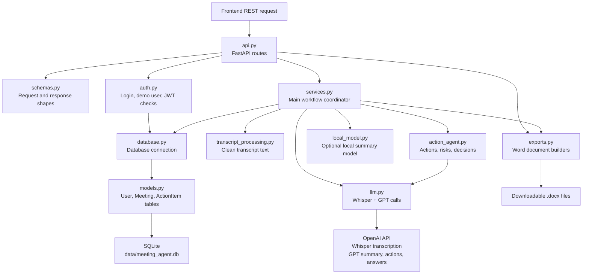

# AI Meeting Action Agent

A full-stack meeting assistant built with React, TypeScript, FastAPI, SQLite, JWT auth, and OpenAI. It turns a Whisper transcript into private meeting records, action items, direct follow-up answers, and downloadable Word reports.

## Main Features

- Transcribe meeting audio with Whisper and format the output into a readable transcript.
- Analyze transcripts with GPT to generate summaries, follow-up answers, risks, decisions, and action items.
- Extract action items with a dedicated GPT call for cleaner task tracking.
- Save meetings, transcripts, summaries, answers, and action boards to SQLite.
- Reopen saved meetings from history and continue managing their action items.
- Add, edit, complete, and delete action items after the meeting.
- Export transcripts and full meeting reports as Word documents.

## Tech Stack

- **Frontend:** React, TypeScript, Vite, CSS
- **Backend:** FastAPI, Python, Pydantic
- **Database:** SQLite, SQLAlchemy
- **Authentication:** JWT bearer tokens, password hashing
- **AI:** OpenAI Whisper API, OpenAI GPT API
- **Exports:** python-docx for Word transcript and report downloads
- **Testing:** unittest, FastAPI TestClient

## Video Demonstration

<p align="center">
  <a href="https://youtu.be/7KSfB6dQjrE">
    
  </a>
</p>

## Backend Workflow Diagram



- `backend/api.py` - FastAPI app and REST routes.
- `backend/auth.py` - password hashing, JWT creation, and token validation.
- `backend/services.py` - analysis, persistence, action CRUD, and export orchestration.
- `backend/models.py` - SQLAlchemy `User`, `Meeting`, and `ActionItem` tables.
- `backend/schemas.py` - API request and response schemas.
- `backend/exports.py` - `.docx` transcript and full-report builders.
- `backend/action_agent.py` - GPT action extraction orchestration, decision detection, and risk detection.
- `backend/llm.py` - Whisper transcription helper and GPT summary, action, and follow-up calls.
- `frontend/src/` - React + TypeScript app.
- `tests/test_backend.py` - API and persistence tests.

## Install

Backend:

```bash
pip install -r requirements.txt
```

Frontend:

```bash
cd frontend
npm install
```

## Run

Start the backend API:

```bash
python -m uvicorn backend.api:app --reload --port 8000
```

Start the frontend:

```bash
cd frontend
npm run dev
```

Open the Vite URL shown in the terminal, usually `http://127.0.0.1:5173`.

## Environment

Create a `.env` file from `.env.example` and set:

```bash
OPENAI_API_KEY=your_openai_api_key_here
OPENAI_TRANSCRIBE_MODEL=whisper-1
OPENAI_SUMMARY_MODEL=gpt-4o-mini
OPENAI_TIMEOUT_SECONDS=120
DATABASE_URL=sqlite:///data/meeting_agent.db
JWT_SECRET_KEY=change_this_to_a_long_random_secret
JWT_EXPIRE_MINUTES=10080
```

The React app expects the API at `http://localhost:8000` by default. To change it, create `frontend/.env`:

```bash
VITE_API_BASE_URL=http://localhost:8000
```
