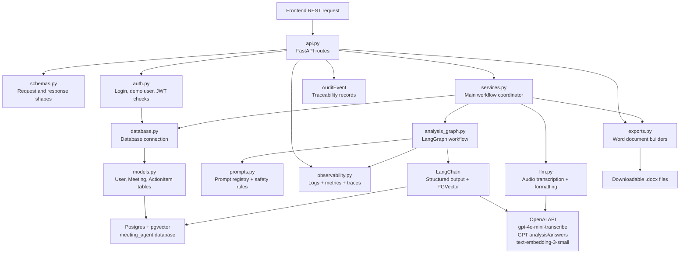

# ai-meeting-action-agent

A full-stack meeting assistant built with React, TypeScript, FastAPI, Postgres/pgvector, JWT auth, and OpenAI. It turns a meeting transcript into private meeting records, action items, RAG-backed follow-up answers, and downloadable Word reports.

## Project Overview

AI Meeting Action Agent is designed for teams that need a cleaner way to turn messy meeting conversations into useful follow-up work. Instead of stopping at a plain summary, the app stores each meeting in a private workspace, extracts decisions and risks, builds a task board from the transcript, and lets users keep managing those action items after the meeting ends.

## Video Demonstration

<p align="center">
  <a href="https://youtu.be/N-ZjkUryrOc">
    
  </a>
</p>

## Main Features

- Durable async worker pipeline for audio, `.docx`, and pasted transcript ingestion.
- Queue-backed transcription with `gpt-4o-mini-transcribe`, followed by automatic transcript cleanup and analysis.
- LangGraph analysis workflow that generates summaries, decisions, risks, and structured action items.
- Current-meeting RAG with LangChain chunking, `text-embedding-3-small`, PGVector storage, and evidence-backed follow-up answers.
- Persistent Postgres workspace for meetings, transcripts, sources, action boards, audit events, and job state.
- Saved meeting history with rename, delete, reopen, and ongoing action-item management.
- Editable action board for adding, updating, completing, and deleting follow-up tasks after analysis.
- Word exports for clean transcripts and full meeting reports that reflect the latest action statuses.

## Operational Readiness

The app includes practical checks and visibility for running the workflow:

- Docker Compose starts the frontend, backend, worker, Postgres/pgvector, and Kafka together.
- Health and metrics endpoints show whether the backend is ready and how the workflow is performing.
- Request IDs, logs, audit events, and optional traces make it easier to follow a meeting job from upload to result.
- Logs avoid sensitive content such as transcripts, source snippets, tokens, passwords, and API keys.
- The Operations dashboard shows job health, worker state, model settings, slow steps, prompt versions, and recent audit events.
- Versioned prompts and eval tests help keep summaries, action items, risks, and follow-up answers grounded in the meeting transcript.

## Tech Stack

- **Frontend:** React, TypeScript, Vite, CSS
- **Backend:** FastAPI, Python, Pydantic
- **Database:** Postgres, pgvector, SQLAlchemy
- **Authentication:** JWT bearer tokens, password hashing
- **AI:** LangChain, LangGraph, OpenAI Transcription API, OpenAI GPT API, OpenAI Embeddings API
- **Observability:** JSON logs, Prometheus metrics, OpenTelemetry tracing, request IDs, audit events
- **Exports:** python-docx for Word transcript and report downloads
- **Testing:** unittest, FastAPI TestClient

## Backend Workflow Diagram



## Docker Setup

Install Docker Desktop first. Docker Compose reads your local `.env` file for secrets such as `OPENAI_API_KEY`, while service database URLs are set in `docker-compose.yml`.

Create a `.env` file from `.env.example`, then set `OPENAI_API_KEY`.

```bash
docker compose up --build
```

The default Kafka topic partition count is `3`, so the three worker consumers can process up to three partition-assigned jobs in parallel.

Open the Vite URL shown in the terminal, usually `http://127.0.0.1:5173`.

## Test

```bash
docker compose --profile test run --rm backend-test
docker compose run --rm backend sh -c "python -m py_compile backend/*.py"
docker compose run --rm frontend npm run build
```

